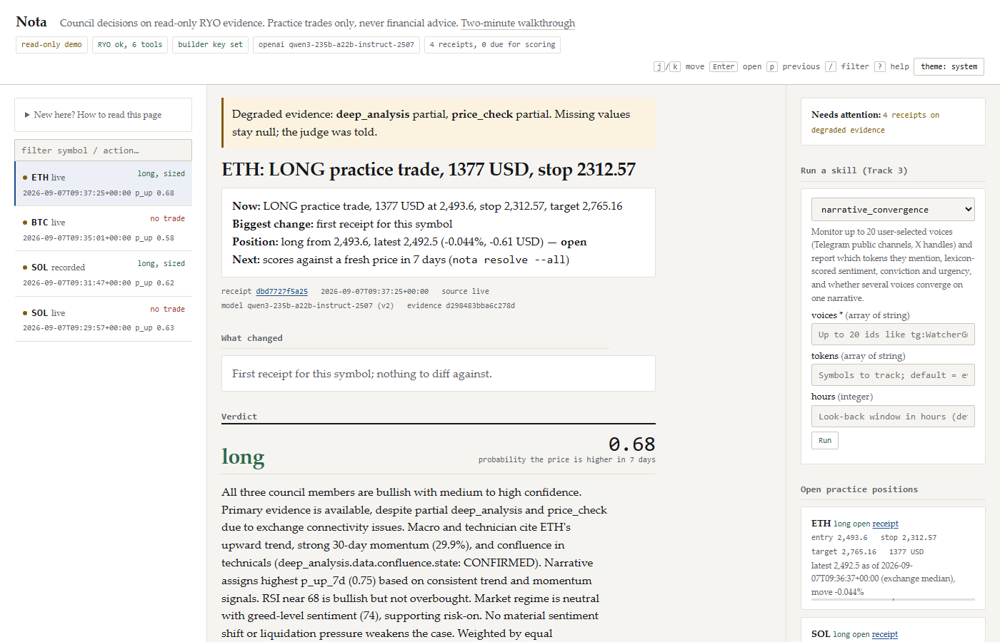
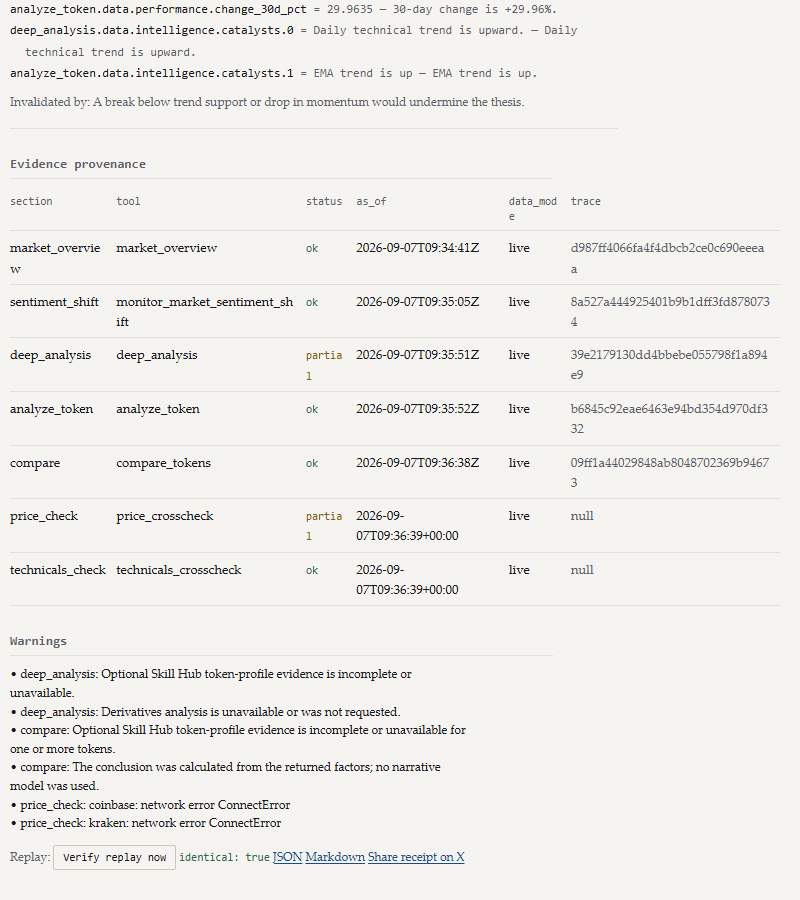
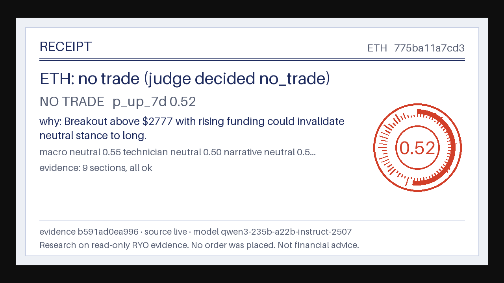
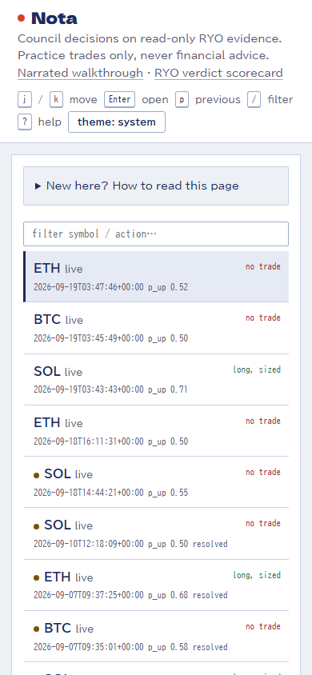

# Nota

An AI trading opinion you can audit. A council of specialised agents debates live RYO market
evidence and records the practice trade it would make as a **replayable decision receipt**:
`nota replay <id>` rebuilds it from the stored evidence and prints `identical: true`, every cited
number is read back out of the evidence rather than retyped by the model, and independent sources
audit RYO's own price and indicators before anything is sized. Built for the RYO-CHAN Hackathon 2026.

Tracks entered: **1 Autonomous Agents** (council, receipts, `watch` loop), **2 Dashboards**
(diff-first receipt dashboard), **3 New Skills** (`narrative_convergence`, `news_verify`,
`price_crosscheck`, `technicals_crosscheck`, all in RYO's envelope).



<details><summary>More screenshots (replay verification, receipt card, phone layout)</summary>





</details>

Screenshots are generated from the shipped demo ledger by `scripts/screenshots.py`.

## How a decision is made

```
gather ──────────► council ──► judge ──► risk (pure ATR math) ──► receipt ──► ledger ──► notify
 5 RYO tools        macro       weighs      entry / stop / target      id = hash(evidence,   Telegram
 + own skills       technician  opinions    or Blocked when price       model, prompts)      Discord
 (price_check,      narrative   by Brier    or ATR is missing
  voices, news)                 weights
```

- **Evidence pack**: `market_overview`, `monitor_market_sentiment_shift`, `deep_analysis`,
  `analyze_token`, `compare_tokens` (the token against BTC/ETH peers). `scan_market` drives
  `nota scan`, RYO's recommended funnel. A failed tool becomes a section with status `error`;
  the pack still exists. Own skills are added as further sections (`price_check` by default,
  `narrative_signal` with `--voices`, `news_check` with `--news`).
- **Council**: three agents (macro, technician, narrative) each return a stance, a
  probability, and **citations as dotted paths into the evidence**. Citations that point at
  a missing or null value are dropped in code (after normalising `x[0].y` to `x.0.y`) and the
  opinion is downgraded.
- **Judge**: weighs opinions by each agent's historical Brier score and decides
  long / short / no_trade.
- **RYO's own plan is evidence, not an instruction**: `deep_analysis.data.trade_plan` carries RYO's
  ATR preview (entry, stop, targets, multiplier, method). Nota sizes independently and then reports
  the gap on the receipt: on the shipped ETH call, RYO stops at 2357.83 on a 1.5× ATR while this
  sizing uses 2.0×, so the stop sits 1.8% of entry lower and the first target 5.4% further, both in
  the same direction.
- **Risk**: a pure function. Stop = 2×ATR(14), target = 3×ATR, size from 1% account risk,
  capped at 20% of the account. No price or no ATR means **Blocked**, never a guessed number,
  and so does an ATR big enough to put the stop or target at or below zero: on an instrument that
  volatile the fixed-multiple rule does not apply, and a receipt must not print a negative price.
- **Replay**: LLM outputs are cached by `(evidence hash, role, prompt version, model)`.
  `nota replay <id>` reproduces the receipt exactly; `--fresh` re-asks the model and prints
  the drift honestly. The dashboard's "Verify replay" button does the cached check only.
- **Calibration**: `nota resolve --all` scores every decision whose seven-day horizon has
  passed (Brier per agent) against a fresh RYO price read, falling back to the exchange median
  from `price_crosscheck` when RYO cannot give a price; the outcome records which source was used.
- **Autonomy**: `nota watch SOL,BTC --every 3600 --notify` decides on a schedule, resolves
  matured decisions, and posts each new receipt to Telegram / Discord. `--scan-top 3` lets the
  loop pick its own candidates from `scan_market` every cycle.
- **Simulated data never trades**: when RYO marks the primary evidence `data_mode: simulated`,
  sizing is blocked and the receipt says so.
- **Transport**: REST (`/tools/{tool}/call`) by default, or MCP JSON-RPC (`tools/list`,
  `tools/call` on the same base URL) with `RYO_TRANSPORT=mcp`; `nota health` lists the live
  tool catalog over MCP when a key is set.

## Honesty rules this code enforces

- Every number in a receipt carries its source path, RYO `as_of`, `data_mode` and trace id.
- `null` / `unavailable` is never converted to 0 (`Envelope.get`, `first_present`, risk,
  every skill).
- Recorded fixtures keep RYO's original `as_of` and `data_mode` and are labelled
  `source: recorded`. Synthetic test fixtures live only under `tests/fixtures/` and are
  labelled `source: fixture`; receipts print the label. There is no fake-LLM mode in the CLI.
- The RYO surface is read-only; practice trades exist only in `nota.db`.
- External sources say what they cannot do: Venice web search carries no dates, the X mirror
  is unofficial, RSS feeds that fail are listed, exchange prices never replace RYO's value.

## Run

```bash
uv sync
cp .env.example .env            # RYO_MCP_KEY + an LLM key (Anthropic, or NOTA_LLM=openai for Venice/OpenRouter)
uv run nota health             # MCP health (no key) + whoami/quota (with key)
uv run nota decide SOL         # live evidence + price cross-check, council, receipt
uv run nota decide SOL --voices tg:WatcherGuru,bs:decrypt.co,bs:unusualwhales.bsky.social --news --notify
uv run nota scan --top-n 5 --decide-top 2      # scan_market -> analyze_token -> council
uv run nota watch SOL,BTC --every 3600 --notify
uv run nota replay <id>        # identical: True
uv run nota replay <id> --fresh
uv run nota resolve --all      # after 7 days: Brier scores per agent
uv run nota scores
uv run nota record SOL         # capture all six live tools into fixtures/recorded
uv run nota decide SOL --source recorded   # replay those recordings without a key (after `record`)
uv run nota positions                      # open practice positions vs the latest independent price
uv run nota serve                          # dashboard + read API on http://127.0.0.1:8000
uv run nota skill spec                     # Track 3 definitions
uv run nota skill run price_crosscheck '{"symbol":"SOL","reference_price":150}'
uv run pytest -q
```

## Skills (Track 3)

All four return RYO's public envelope field for field (`docs/skills/SKILL-SPEC.md`) and are
served on RYO's own skill paths, so plugging them into RYO is a route registration, not a port:
`GET /api/skills/` (SkillDefinition list), `GET /api/skills/{name}`, and
`POST /api/skills/{name}/invoke` taking `SkillCallRequest {name, args, conversation_id}` and
returning `SkillCallResponse {name, status: success|error, result, latency_ms, xp, guard_decision}`.
The dashboard's "Run a skill" panel builds its form from those definitions and shows the envelope.

- `narrative_convergence`: up to 20 voices (`tg:` public Telegram previews, `bs:` Bluesky
  public API, `x:` via a Nitter mirror with Tavily fallback), VADER sentiment plus a crypto
  lexicon, conviction, urgency, and convergence detection. Silence is `null`, not 0.
- `news_verify`: dated headlines from CoinDesk, Cointelegraph, The Block and Decrypt RSS,
  plus Tavily or Venice web search for breadth; counts independent domains and attaches RYO
  `analyze_token` context.
- `price_crosscheck`: keyless CoinGecko, Coinbase and Kraken spot prices, median, spread, and
  deviation of a reference price (RYO's) from the exchanges, plus the alternative.me Fear &
  Greed index against RYO's reading.
- `technicals_crosscheck`: RSI(14), ATR(14) and 1d/7d/30d performance recomputed with Wilder's
  method from CoinGecko public OHLC (4-hour candles aggregated to UTC days), with the deviation
  of reference values (RYO's `technicals.rsi_14` / `atr_14`) from the independent calculation.
  The Technician sees it as `technicals_check` on every decision.

## Nota is also an MCP server (Track 3)

Nota is an MCP client of RYO. It is also an MCP server, so RYO, Claude Desktop, Cursor or any other
MCP host can call the four skills directly with no wrapper:

```jsonc
// claude_desktop_config.json, or any MCP client that speaks Streamable HTTP
{ "mcpServers": { "nota": { "url": "https://nota-ryo.vercel.app/mcp" } } }
```

```bash
curl -s https://nota-ryo.vercel.app/mcp -H 'content-type: application/json'   -d '{"jsonrpc":"2.0","id":1,"method":"tools/list"}' | jq '.result.tools[].name'

curl -s https://nota-ryo.vercel.app/mcp -H 'content-type: application/json'   -d '{"jsonrpc":"2.0","id":2,"method":"tools/call","params":{"name":"technicals_crosscheck","arguments":{"symbol":"SOL"}}}'
```

One endpoint, POST only, stateless. It negotiates the protocol version the client asks for
(`2026-07-28`, `2025-06-18`, `2025-03-26` or RYO's own `2024-11-05`), validates the `Origin` header
against DNS rebinding as the transport spec requires, answers a batch with one response per request,
returns `202 Accepted` with no body when the body holds only notifications, and answers `405` to GET
and DELETE because there is no stream to open and no session to delete. Each tool's `inputSchema` is
generated from the same skill definition the REST route and the dashboard form use, so the three can
never drift apart. `tools/call` returns the RYO envelope twice: as text for clients that only read
text, and as `structuredContent` for clients that parse.

## Dashboard (Track 2)

`nota serve` exposes a read-only API over the ledger (`/api/decisions`, `/api/decisions/{id}`,
`/api/decisions/{id}/replay`, `/api/positions`, `/api/scores`, `/api/health`, exports
`/r/{id}.json` and `/r/{id}.md`, OpenAPI at `/docs`) and a single-page dashboard:

- **Thirty-second summary** at the top of every receipt: what to do now (trade or block reason),
  the single biggest change and why it matters, whether the open practice position would be
  stopped out or at target at the latest independent price, and what happens next (when it
  is scored, or the score).
- **What changed**: every receipt is diffed against the previous receipt for the same symbol
  and the rows are ranked by impact. Verdict flips, trade unlock/block, availability and model
  changes come first, then the numbers the risk engine reads (price, ATR, RSI) by % move, then
  every other evidence leaf. A value that became `null` is shown as `null`, never as 0.
- **Degraded mode**: a banner names each evidence section that is not `ok`; provenance shows
  `as_of`, `data_mode` and trace id per section.
- **Open practice positions** against the latest evidence price, with distance-to-stop.
- **Agent leaderboard** by Brier score with the judge weights currently in force, and a judge
  calibration table (stated `p_up_7d` bucket vs realised hit rate) once decisions resolve.
- **Verify replay** from the page (cached outputs only, never spends), share to X, exports.
- **Works for everyone**: skip link, real buttons, visible focus, `aria-live` updates,
  keyboard `j`/`k` move, `Enter` open, `p` previous receipt, `/` filter, `?` help.
- Polls the ledger every 30 s so a running `watch` loop shows up without a reload.

The dashboard reads receipts only. It cannot show a number that has no receipt behind it.

## SocialFi layer

- **Receipt cards**: `/r/<id>.png` renders a 1200×630 card from the receipt (Pillow, bundled
  font); `/r/<id>` carries Open Graph and X card tags pointing at it, so a shared permalink
  previews as the receipt. Discord notifications embed the same image.
- **Backing**: anyone can back or disagree with a call under a handle (`POST
  /api/decisions/<id>/back`, one stance per handle per receipt, latest wins). When the call
  resolves, backers are scored against the outcome (`/api/backers`): agreeing with a long that
  went up is right, disagreeing with it is wrong, `no_trade` calls are never scored. It is
  public and unauthenticated on purpose; the ledger keeps every stance with its timestamp.

## Evaluate with zero keys

The repository ships a ledger snapshot of four receipts made on live RYO evidence (2026-09-07,
SOL / BTC / ETH, each labelled with its own source) and every one of them verifies:

```bash
uv sync
NOTA_DB=data/demo.db uv run nota replay b80b42835b01   # identical: True - verified with no key at all
NOTA_DB=data/demo.db uv run nota serve      # dashboard, replay verification, cards, skills, backing
NOTA_DB=data/demo.db uv run nota positions
uv run nota skill run price_crosscheck '{"symbol":"SOL"}'   # live exchanges, no key
uv run pytest -q                              # 139 tests
```

The first line is the point of the project: a cached replay rebuilds the receipt from the ledger's
own evidence and the model outputs stored beside it, keyed by the model that produced them, so it
touches no API and cannot drift. Every one of the five shipped receipts verifies this way, including
the one made under a different provider. `--fresh` is the opposite: it calls today's model on the
same evidence and prints the differences as drift.

A council decision needs one LLM key (Anthropic, or any OpenAI-compatible provider such as
Venice) and live RYO evidence needs the builder key; everything else, verification included, runs
without either.

## Hosted demo

A read-only copy of the dashboard runs at https://nota-ryo.vercel.app (Vercel, framework-detected
FastAPI via `main.py`). It serves the committed ledger snapshot `data/demo.db` (four receipts on live
RYO evidence, each carrying its trace ids) with `NOTA_READONLY=1`: reads, replay verification, cards and exports
work; backing answers 503 because a serverless filesystem cannot be written. The full system,
including live RYO evidence, the `watch` loop, notifications and backing, runs with
`uv run nota serve` on any machine with a writable disk.

## Failure handling

- RYO client: exponential backoff with jitter on 429/503/network, honours `Retry-After`,
  never retries 4xx argument errors, records `X-RateLimit-*` headers.
- Evidence gathering continues past failed tools and skills; the judge is told which sections
  are missing and is instructed to prefer `no_trade` when primary evidence is gone.
- SQLite ledger in WAL mode; every write is idempotent by content hash, so a restart resumes.
- `watch` survives a failing symbol, a failing notifier and a failing resolution.
- RSS is parsed with `defusedxml` (no entity expansion from untrusted feeds).
- Some ISPs DNS-block exchange domains (seen from Indonesia: Coinbase and Kraken resolve to a
  block page with a bad certificate). `price_crosscheck` then reports those sources
  `unavailable` and works from whatever remains; the hosted demo on Vercel reaches all three.

## Layout

```
nota/
  envelope.py     RYO public response contract + REST/MCP parsers
  ryo_client.py   RyoClient (httpx) + RecordedRyoClient + record()
  ledger.py       SQLite: evidence, llm_cache, decisions, outcomes
  evidence.py     EvidencePack, ryo_args(), gather(), candidate_symbols(), path lookups
  paths.py        candidate paths for price / ATR (one place to fix when the live schema is recorded)
  llm.py          LLM protocol, AnthropicLLM (messages.parse), OpenAICompatLLM (Venice/OpenRouter)
  council.py      role prompts, Opinion/Verdict, citation validation, cached run_council()
  risk.py         size_trade(): PracticeTrade | Blocked
  receipt.py      Receipt + markdown rendering
  notify.py       Telegram Bot API + Discord webhook publishing
  api.py          FastAPI read API + static/index.html dashboard
  skills/         contract, sources (Telegram, Nitter, RSS, Tavily, Venice), narrative, news, price_check
  decide.py / replay.py / calibration.py / cli.py
docs/             hackathon analysis, MCP builder guide copy, design spec, skill spec, submission draft
tests/            pytest, no network (respx + FakeLLM test double)
```

## Disclosed third-party libraries

httpx, pydantic, anthropic, typer, python-dotenv, fastapi, uvicorn, vaderSentiment (MIT),
defusedxml, pillow; dev: pytest, respx, playwright (browser end-to-end tests in
`tests/test_dashboard_e2e.py`, run after `uv run playwright install chromium`). Data sources:
RYO MCP, t.me/s previews, Bluesky public AppView, Nitter mirrors via twiiit, CoinDesk /
Cointelegraph / The Block / Decrypt RSS, CoinGecko, Coinbase, Kraken and alternative.me public
APIs, Tavily or Venice web search. All application code was written during the hackathon.
